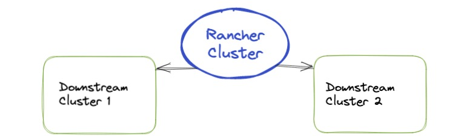
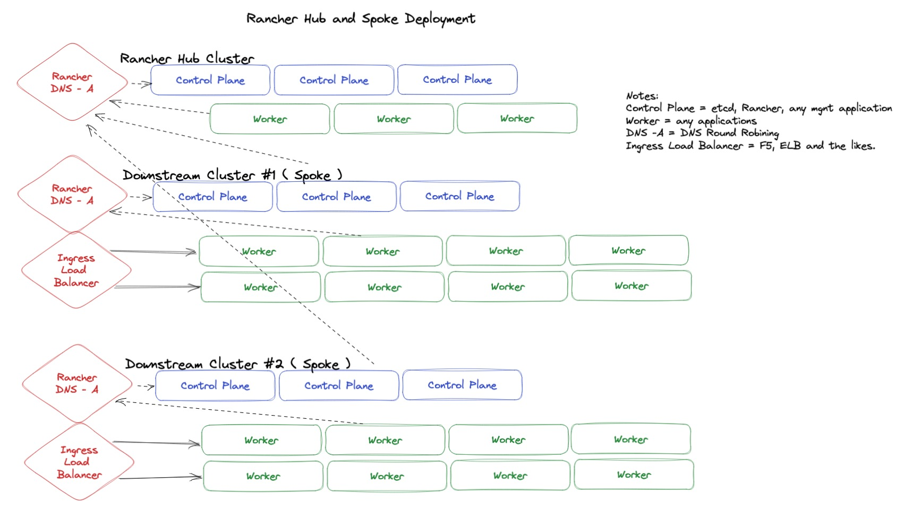

# Reference Architecture for the Rancher Stack


## Table of Contents

* [About Us](#about-us)
* [Introduction](#introduction)
* [Rancher Stack](#rancher-stack)
* [Rancher](#rancher)
* [Node Sizing | CPU, Memory, and Storage](#node-sizing--cpu-memory-and-storage)
  * [Operating System](#operating-system)
  * [Selinux](#selinux)
  * [Kernel Tweaks](#kernel-tweaks)
* [RKE2 - Kubernetes](#rke2---kubernetes)
* [Networking](#networking)
* [Longhorn](#longhorn)
* [Final Thoughts](#final-thoughts)

## About Us

A little bit Zack Brady, his history, and what he's done in the industry.

* DOD/IC Contractor
* U.S. Military Veteran
* Open-Source Contributor
* Built and Exited a Digital Firm
* Volunteer Firefighter/EMT

A little bit Andy Clemenko, his history, and what he's done in the industry.

* DOD/IC Contractor
* Docker Federal (PS, SE, TAM)
* RedHat/Stackrox Federal (SE)
* Rancher Advocate (6+ Years)
* Volunteer Firefighter/EMT/Pump Operator

## Introduction

It's almost impossible to configure and implement a solution to fit every customer, every environment, and every situation. Hopefully this reference architecture will be able to provide you a great starting point to apply to your customer, your environment, and your situation. This guide is intended to highlight an ideal deployment of Rancher and a few downstream clusters.

By the end of this guide we will have a very good sense of what a production deployment of Rancher looks like. Use this guide to build your clusters or compare to what has already been built. This guide is solely looking at the operating system up. Meaning we do include tips for virtualized environments like affinity rules.

Let's start by looking at the Rancher stack.

## Rancher Stack

There are other great products in the catalog, but we are going to focus on the "trinity" of RKE2, Rancher, and Longhorn for this guide. We need to think about the Operating System for this guide.

* Operating System of Choice - We prefer RPM based due to Selinux support.
* [RKE2](https://www.rancher.com/products/rke) - Rancher's Kubernetes Distribution
* [Rancher](https://www.rancher.com/products/rancher) - Multi-Cluster Kubernetes Manager
* [Longhorn](https://www.rancher.com/products/longhorn) - Rancher's Persistent Storage

Let's look at the Rancher Deployment Strategy before we talk specifics.

## Rancher



Good news, Rancher's [documentation](https://ranchermanager.docs.rancher.com/reference-guides/best-practices/rancher-server/rancher-deployment-strategy) lays out two Rancher Deployment Strategies, Hub & Spoke and Regional. We are going to focus on the Hub & Spoke Strategy. This will give us the best flexibility for most use cases. When looking at the Hub & Spoke Strategy we need to break down the requirements for the Hub cluster and the Spoke clusters.

Starting with the Hub cluster. The focus of the Hub cluster is provide enough resources for the Rancher "application" to manage the downstream clusters. The important components for the Hub cluster is cpu and memory for [etcd](https://etcd.io/). This means we need to give a little more cpu/memory head room for this cluster. Because these nodes are cpu/memory heavy we do not need as much disk space. The number of nodes is also important. We want to ensure that we have high availability, aka redundancy. For this three (3) is the magic number. With the consensus algorithms they have found that five (5) or more nodes actually slow down the process. The RKE2 have some good docs for [high availability](https://docs.rke2.io/install/ha). The Rancher [documentation](https://ranchermanager.docs.rancher.com/reference-guides/best-practices/rancher-server/tips-for-running-rancher) has a few tips to think about.

The Spoke clusters have a slightly different strategy. [High availability](https://docs.rke2.io/install/ha) is still important. The main difference is around storage and the node sizing to accommodate the anticipated application load. Meaning ensure that there are enough nodes with resources to handle the level of failure the applications and handle. This can be tricky to figure out. Best rule of thumb is have around 30% of the cluster's total resources free. Feel free to reach out to us if you want to deep dive on capacity planning. The Rancher docs has a small section on [capacity planning](https://ranchermanager.docs.rancher.com/reference-guides/best-practices/rancher-server/tips-for-running-rancher#monitor-your-clusters-to-plan-capacity) that is worth a read.

We can also look at the [best practices documentation](https://ranchermanager.docs.rancher.com/reference-guides/best-practices/rancher-server/tips-for-running-rancher) for tips on deploying Rancher on the management cluster.

## Node Sizing | CPU, Memory, and Storage

As we just highlighted we have two different strategies for the Hub and Spoke clusters. There is another differentiator to think about. Control Plane nodes versus Worker nodes. Control Plane nodes are used for the management of the local cluster with components like the API server and etcd. The Workers are where the applications are run from. Speaking of applications, it makes more sense to combine CPU Memory and Storage into this section. Rancher has some good [documentation](https://ranchermanager.docs.rancher.com/pages-for-subheaders/installation-requirements#hardware-requirements) on the subject. We can be more prescriptive here. Keep in mind that you can run other "Enterprise" applications on the Hub cluster. Several that come to mind are [Harbor (Registry)](https://goharbor.io/) and [Gitea (Version Control)](https://gitea.io/en-us/). Review the chart.

| Cluster Type   | CPU | Memory | Disk | Node Count |
| --- | --- | --- | --- | --- |
| Hub - Control Plane | 4 Core | 8 GB | 100 GB| 3 |
| Hub - Worker | 8 Core | 16 GB | 200 GB | 3+ |
| Spoke - Control Plane | 4 Core | 8 GB| 100 GB | 3 |
| Spoke - Worker | 8 Core | 16 GB | 200 GB| 3+ |

Please note that the values above are starting points. If your applications are not that disk intensive, or you plan on using cloud provided storage you can lower the Disk sizes. All nodes should leverage SSD or faster storage. All nodes should have their load averages monitored. This will give you an indication of when the nodes needs to be scaled. Control Plane nodes should be scaled with more cpu and memory. The worker nodes should be scaled with more nodes. Observability is going to really important here. Good thing Rancher has Grafana, Prometheus, Fluentd charts built in.

Please read through the [Longhorn](#longhorn) section. If the plan is to leverage Longhorn there are two settings that can be tweaked to better utilize the storage resources. This will also play into the node count.

One strategy that we might want to consider is the "lot of little" nodes. This strategy works better to handle failures and upgrades. Meaning when a node goes down there is not a lot of the total capacity lost. Case in point, if we have 4 worker nodes and one goes down we have lost 1/4 or 25% of the total capacity. Where as with 10 worker nodes, we would only lose 10% of the total capacity. This is also helps with distributing the applications across more surface area, aka nodes. And remember we do not have to create a cluster with heterogeneous nodes. We can vary the nodes sizes and counts to fit our specific needs.

### Operating System

For this guide we are going to look at RPM based distributions for the Selinux support. Rancher Government Solutions is focused more on the security side of things. Rocky/RHEL are the preferred Operation Systems. Debian based ones will work as well.

### Selinux

All nodes need Selinux enabled and in enforcing mode. This will greatly increase the defenses from anything malicious.

### Kernel Tweaks

Over the years we have seen some really good kernel tweaks for the OS when running containers. Comments are inline. All nodes should have these tweaks applied.

```bash
cat << EOF >> /etc/sysctl.conf
# SWAP settings
vm.swappiness=0
vm.panic_on_oom=0
vm.overcommit_memory=1
kernel.panic=10
kernel.panic_on_oops=1
vm.max_map_count = 262144

# Have a larger connection range available
net.ipv4.ip_local_port_range=1024 65000

# Increase max connection
net.core.somaxconn=10000

# Reuse closed sockets faster
net.ipv4.tcp_tw_reuse=1
net.ipv4.tcp_fin_timeout=15

# The maximum number of "backlogged sockets".  Default is 128.
net.core.somaxconn=4096
net.core.netdev_max_backlog=4096

# 16MB per socket - which sounds like a lot,
net.core.rmem_max=16777216
net.core.wmem_max=16777216

# Various network tunables
net.ipv4.tcp_max_syn_backlog=20480
net.ipv4.tcp_max_tw_buckets=400000
net.ipv4.tcp_no_metrics_save=1
net.ipv4.tcp_rmem=4096 87380 16777216
net.ipv4.tcp_syn_retries=2
net.ipv4.tcp_synack_retries=2
net.ipv4.tcp_wmem=4096 65536 16777216

# ARP cache settings for a highly loaded docker swarm
net.ipv4.neigh.default.gc_thresh1=8096
net.ipv4.neigh.default.gc_thresh2=12288
net.ipv4.neigh.default.gc_thresh3=16384

# ip_forward and tcp keepalive for iptables
net.ipv4.tcp_keepalive_time=600
net.ipv4.ip_forward=1

# monitor file system events
fs.inotify.max_user_instances=8192
fs.inotify.max_user_watches=1048576

# disable ipv6
net.ipv6.conf.all.disable_ipv6 = 1
net.ipv6.conf.default.disable_ipv6 = 1
EOF
sysctl -p
```

Now we can look at Kubernetes.

## RKE2 - Kubernetes

Of course we prefer [RKE2](https://docs.rke.io) for the simple fact that it is the only Kubernetes with a DISA STIG. There is a nice article about it from [Businesswire](https://www.businesswire.com/news/home/20221101005546/en/DISA-Validates-Rancher-Government-Solutions%E2%80%99-Kubernetes-Distribution-RKE2-Security-Technical-Implementation-Guide). We even has a [tl;dr](https://github.com/clemenko/rke2/blob/main/RKE2_STIG.md) with the config. One important thing to implement is that all the Control Plane nodes should be configured in [High Availability](https://docs.rke2.io/install/ha) mode. At a high level the three Control Plane nodes should use DNS round robin or a Layer 4 Load Balancer. The [docs](https://docs.rke2.io/install/ha) go into greater detail. And the other good news is that RKE2 is 100% air gap compliant.

Another tweak at our disposal is to reserve kubernetes or system resources. The Kubernetes documentation site has a [page](https://kubernetes.io/docs/tasks/administer-cluster/reserve-compute-resources/) on the subject. These settings allow us to limit the amount of resources that can be allocated to applications versus kube itself.

Bottom Line:

* Control Plane nodes in High Availability
* All nodes STIG'd
* Reserve system resources - as needed

Let's take a look at how all the nodes are connected.

## Networking



Networking can be painful if we let it be. If we break the problem down it can be easy. Let's start with the official [Port List](https://ranchermanager.docs.rancher.com/getting-started/installation-and-upgrade/installation-requirements/port-requirements). We can see that there are potentially a lot of ports that need to be open. For this reason I recommend to keep the firewalls and security groups wide open between the nodes. What helps with this is if each cluster is contained within a subnet or VPC. This makes the security groups and firewalls easier to manage. Another major consideration is around the Rancher Load Balancer and Ingress. Ideally we want to have at least two dedicated Load Balancer for Ingress. Each cluster will have an external Load Balancer pointing to the Ingress ports.

## Longhorn

Longhorn has a few tweaks that should be considered. The Longhorn [Best Practices](https://longhorn.io/docs/1.4.0/best-practices/) pages highlights some interesting points. The main takeaway for this guide is the [Minimal Available Storage](https://longhorn.io/docs/1.4.0/best-practices/#minimal-available-storage-and-over-provisioning) section. Here the guide recommends setting the `minimal available storage percentage` to 25% and the `overprovisioning percentage` to 200%. The best way to set these two settings is with the following Helm command.

```bash
helm upgrade -i longhorn  longhorn/longhorn -n longhorn-system --create-namespace --set ingress.enabled=true --set ingress.host=longhorn.$domain --set default.storageMinimalAvailablePercentage=25 --set default.storageOverProvisioningPercentage=200 
```

Keep in mind that the Over-provisioning percentage really depends on level of disk utilization of the Persistent Volume Claims. Meaning it depends on the average use of the "requested" volume sizes.

## Final Thoughts

There is another Rancher Deployment Strategy that could be considered, Decoupled. Decoupled is a strategy that fits the resource constrained environments. That tactical edge is one such environment. In this type of environment it may make sense to ONLY deploy Rancher and all the applications on a single cluster, aka the Rancher cluster. There are also circumstances where the Rancher "application" may not be needed. Thanks to the modularity of the stack we have the flexibility to choose the right components for the right situation.

Hopefully this guide has helped with understanding what a "production" deployment of the Rancher stack looks like. We can see that there are a lot of "game time" decisions that are made. There is not a single deployment to fit all environments. If there are questions please feel free to reach out.
